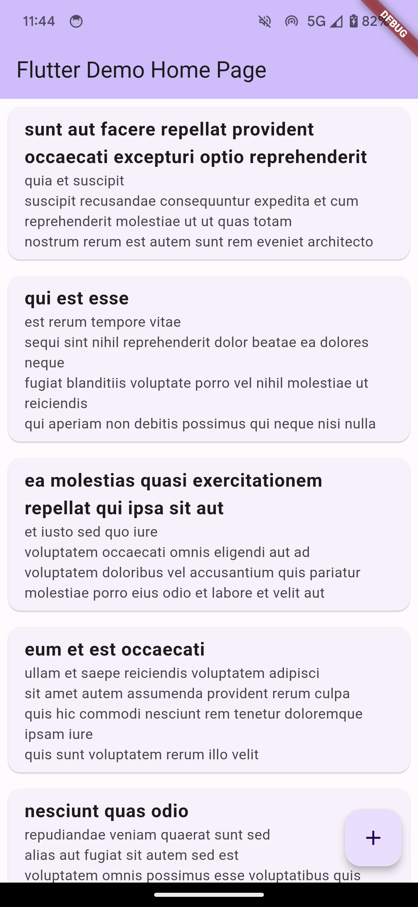

# Flutter API Fetcher

</img>

## Description

This Flutter application fetches data from a sample API and displays it in a list. Users can fetch the data by clicking a Floating Action Button. The app also checks for Internet connectivity and shows an alert dialog if no connection is available.

## Features

- Fetch data from API
- Show data in a list view
- Internet connectivity check
- Alert dialog for no Internet connection

## Getting Started

### Dependencies

- Flutter SDK
- Dart
- [`http`](https://pub.dev/packages/http)
- [`connectivity`](https://pub.dev/packages/connectivity)

### Installation

- Clone this repository: `git clone https://github.com/your-github-username/flutter_api_fetcher.git`
- Install all dependencies by running: `flutter pub get`

### Run the App

Execute the following command to run the app:

```bash
flutter run
```

## How to Use

1. Open the app.
2. Click the Floating Action Button at the bottom right corner.
3. If you're connected to the Internet, the app will fetch and display data from the API.
4. If you're not connected to the Internet, an alert dialog will pop up.

## Contributing

If you want to contribute to this project, you're always welcome! See [Contributing Guidelines](CONTRIBUTING.md).

## License

This project is licensed under the MIT License - see the [LICENSE.md](LICENSE.md) file for details.

## Acknowledgments

- The data is fetched from [JSONPlaceholder](https://jsonplaceholder.typicode.com/), a free online REST API that you can use whenever you need some fake data.

---
